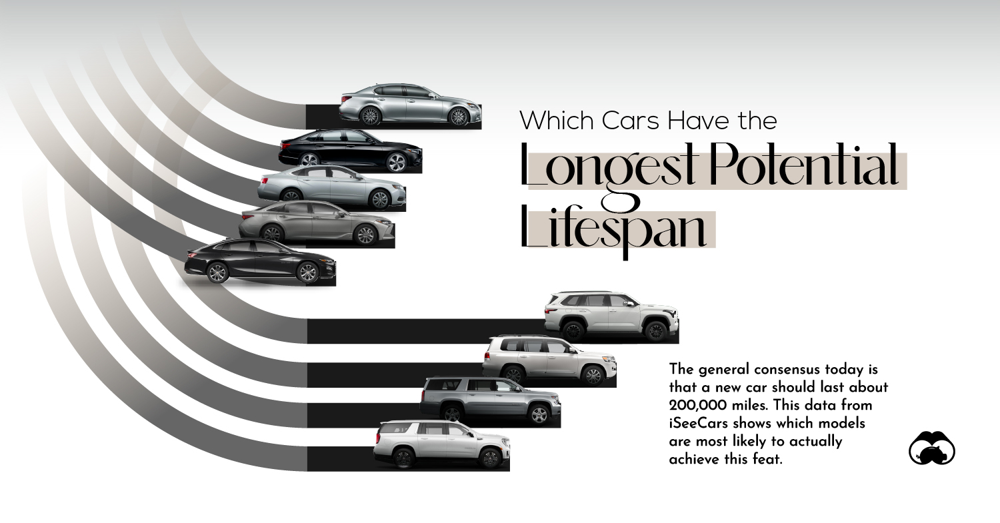
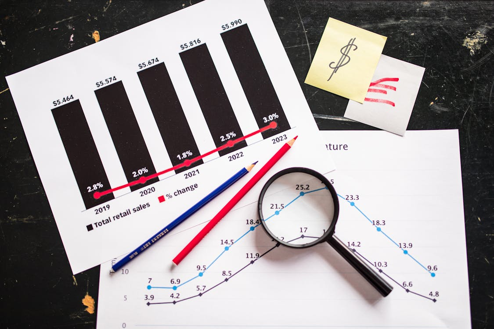
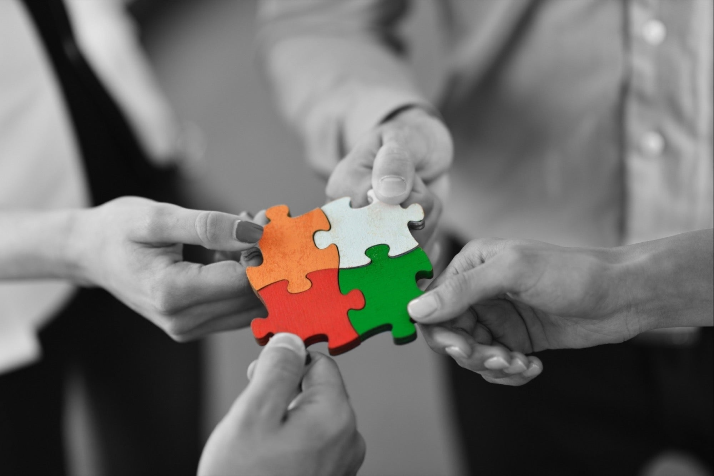

# 👋 Hello, I'm El Mehdi Lahrach
Data Scientist | Collective Intelligence

I'm a data enthusiast passionate about leveraging the power of data to drive innovation and solve complex problems. Whether it’s through machine learning models, statistical analysis, or data storytelling, my goal is to contribute to creating a more data-driven future.

## 🚀 About Me
Currently pursuing a Master’s in Collective Intelligence at Mohammed VI Polytechnic University, I have a solid foundation in computer science and data analysis. I’m particularly interested in social behaviors,  analysis, and forecasting models.

In the past few years, I’ve had the opportunity to work on diverse projects that push the boundaries of machine learning, data science, and data visualization. I enjoy creating impactful solutions by extracting insights from messy datasets and communicating them effectively.

# 💡 What I Do

**Data Science**: Building data models, wrangling large datasets, and deriving insights.  

**Research in Collective Intelligence**: Exploring the relationship between innovation and team composition.  

# 🔬 Projects
Genomic Clustering (April 2024)
Using machine learning to categorize Mycobacterium tuberculosis strains, contributing to the understanding of genetic diversity in Africa.

Land Cover Classification in Casablanca (April - June 2023)
Applied geospatial analysis and machine learning to classify land cover, assisting urban planning initiatives.

# 🎓 Education
- Master's in Collective Intelligence, Data Science Specialization
Mohammed VI Polytechnic University, 2023 - 2025

- Bachelor of Computer Science
Chouaib Doukkali University, 2020 - 2023

# 🛠️ Skills
Languages: Python, SQL, Java, C++, JavaScript
Frameworks & Tools: Pandas, NumPy, Scikit-learn, ggplot2, Jupyter Notebooks
Soft Skills: Analytical thinking, problem-solving, critical thinking

# 🏆 Achievements
2nd Place, Fintech Hackathon by Mastercard and ACC (November 2023)
4th Place, AI for Disaster Risk Reduction at Unleash Hackathon (March 2024)
